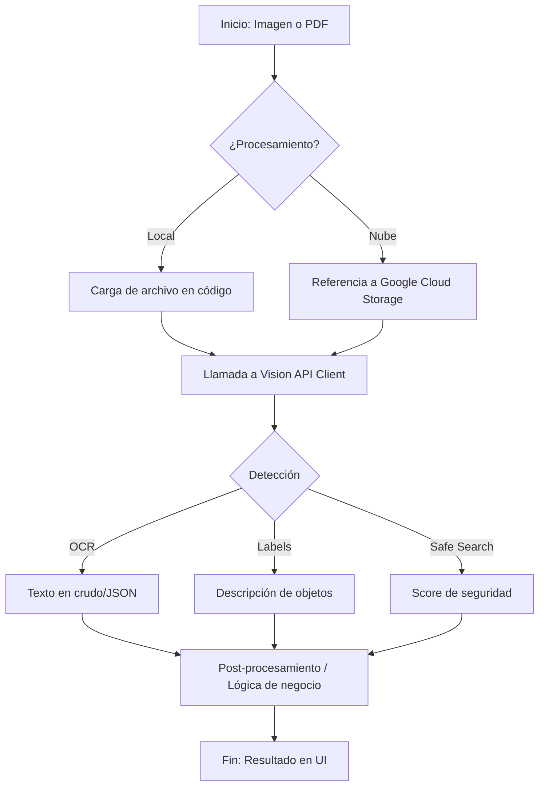

# Flujo de Trabajo: Google Vision API

Este documento explica cómo opera la herramienta y aclara las diferencias con Modelos de Lenguaje como Gemini.

## Flujo de Uso (Workflow)

## Diferencias Técnicas: Vision API vs Gemini

Es común confundirlas, pero son herramientas con naturalezas distintas:

| Característica | **Google Cloud Vision** (Especializada) | **Gemini** (Multimodal LLM) |
| :--- | :--- | :--- |
| **Naturaleza** | API determinística y de alta precisión. | Modelo de lenguaje con razonamiento. |
| **System Prompt** | **No usa**. Se usa configuración de "Features". | **Sí usa**. Se define el rol y comportamiento. |
| **Input** | Estructura JSON (Features desired). | Prompt en lenguaje natural + imagen. |
| **Output** | JSON con coordenadas y puntajes exactos. | Texto explicativo o datos inferidos. |
| **Caso de uso** | OCR masivo, auditoría rápida, etiquetas. | Análisis complejo, extracción por razonamiento. |

## ¿Cómo se configura el "comportamiento"?

En Google Vision API **no existe el "System Prompt"**. En su lugar, el flujo es el siguiente:

1.  **Request Construction**: Tú le indicas a la API qué "características" (Features) quieres analizar (ej: `TEXT_DETECTION`, `LABEL_DETECTION`).
2.  **Parámetros de Configuración**: Puedes definir límites, como por ejemplo el número máximo de etiquetas que quieres recibir.
3.  **Respuesta Estructurada**: Recibes un objeto JSON muy detallado con coordenadas de cada palabra o puntajes de confianza.

---
> [!TIP]
> Si buscas "entender" por qué hay un perro en la imagen, usa Gemini. Si buscas "obtener el texto exacto de una factura y su posición", usa Google Vision API.
